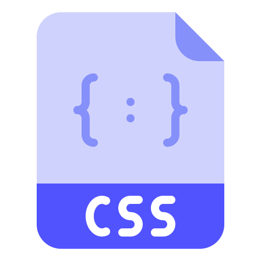

# Tour Guide 
This is a collage project that is made by Avinash Kumar and Abhishek Bulbule under the guidence of the teacher Padma Nene.
---
 
The project repository consists of all file required to host the website online.

>Scripting language and framework used  
> 
> 
> 

## Regarding the website system 
The website helps anyone to select the places that they want to visit in the given time and give a estimate budget (*on per day baisis) with the information for the accomodation, food, the travel and reachablity to a place.

Currently as the system is avilable with the pre embeded data so we have covered the places from the Maharashtra and popular places only.

___

## Lisenseing
>Anyone is free to use the project as a reference or as a whole for their own purpose or in non-profitable way. Any instance of selling the source code or using it in profitable way is not permitted.